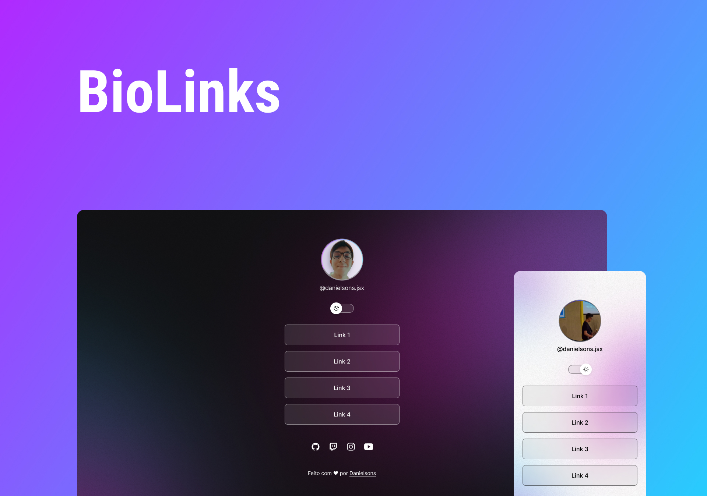

<h1 align="center">BioLinks </h1>

Projeto para facilitar acesso a portifólios, redes sociais e links em geral

<a href="#-tecnologias">Tecnologias</a>
|
<a href="#-projeto">Projeto</a>
|
<a href="#-layout">Layout</a>
|
<a href="#-memo-licença">Licença</a>

 

 

## 🚀 Tecnologias

Esse projeto foi desenvolvido utilizando:

- HTML
- CSS
- JS
- Git e Github
- Figma

## 💻 Projeto

Projeto desenvolvido em 25.02.2023 com o intuito de facilitar o acesso de clientes a portifólios, redes sociais e contato do seus provedores de serviço

## 🏰 Layout

Você pode visualizar o projeto através [DESSE LINK](https://www.figma.com/file/20oE6aSB7CcBzh5z5sYfbU/BioLinks(danielsons.jsx)?t=c3JAztMQc3bFP3zJ-0). É necessário ter conta no [Figma](https://Figma.com) para acessá-lo.

## :memo: Licença

Esse projeto está sob a Licença MIT.

---

Feito com 🤍 por [Danielsons](https://instagram.com/danielsons.jsx)''
